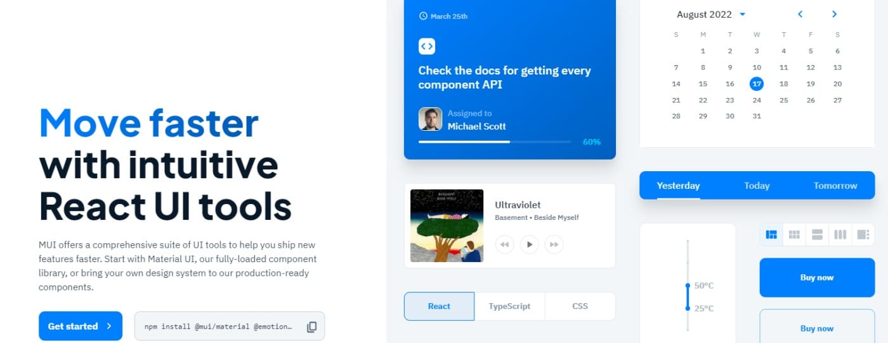
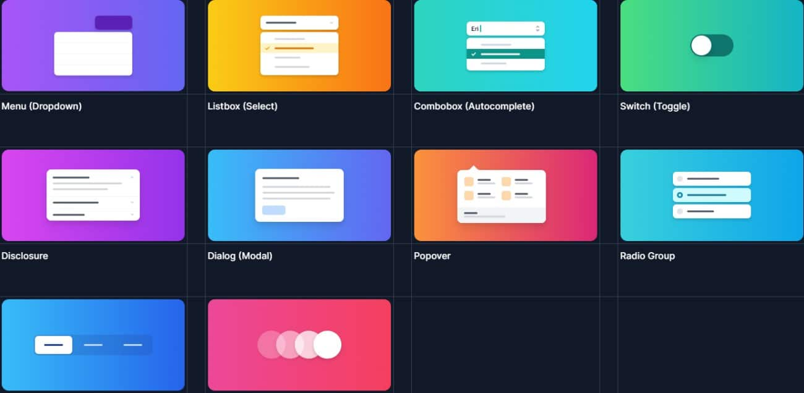
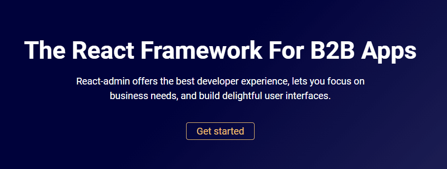

# React UI-Komponentenbibliotheken
> *Basierend auf [React UI-Komponentenbibliotheken: Unsere Top-Picks für 2023](https://kinsta.com/de/blog/react-komponenten-bibliotheken/)*  

React UI-Komponentenbibliotheken sind nützliche Werkzeuge, mit denen du atemberaubende Oberflächen für deine React-basierten Softwareanwendungen und Websites erstellen kannst.

Du kannst zwar für jedes Feature oder jede Funktion, die du in dein Design einbauen willst, deinen eigenen Code schreiben, aber mit einer UI-Komponentenbibliothek wird die ganze Aufgabe einfacher und schneller.

Sie ermöglicht es dir, genau das Teil zu verwenden, das du in deinem Design haben möchtest, z. B. eine Schaltfläche, ohne den Code dafür von Grund auf neu schreiben zu müssen.

Das spart dir nicht nur viel Zeit und Mühe, sondern gibt dir auch die Möglichkeit, über größere Probleme nachzudenken und an Innovationen zu arbeiten.

Jedes Mal, wenn du eine allgemeine Funktion wie eine Tabelle oder eine Karte oder sogar erweiterte Optionen wie Themes hinzufügen möchtest, kannst du einfach aus den verfügbaren Optionen wählen und sie direkt in deinem Design verwenden

Dadurch wird dein Softwareentwicklungsprozess insgesamt schneller und du kannst in kürzerer Zeit mehr hochwertige Anwendungen erstellen.

Wenn du also React-basierte Software entwickelst, ist die Verwendung einer React UI-Komponentenbibliothek von großem Nutzen für dich.

In diesem Artikel stellen wir dir die 21 besten React UI Komponentenbibliotheken vor, die du in deinem nächsten Projekt verwenden kannst. Bevor wir loslegen, wollen wir ein paar grundlegende Konzepte durchgehen, damit du die React UI-Komponentenbibliotheken besser verstehen kannst.

- [Was sind React UI-Komponentenbibliotheken?](https://github.com/RalfGuder/react-admin/wiki)
## Was sind React UI-Komponentenbibliotheken?
Eine React UI-Komponentenbibliothek ist ein Werkzeug oder ein Softwaresystem, das gebrauchsfertige Komponenten für React-basierte Anwendungen und Websites enthält. Diese Komponentenbibliotheken helfen dabei, die Softwareentwicklung zu beschleunigen und bieten Entwicklern und Unternehmen viele Vorteile.

Die Komponenten in einer Komponentenbibliothek können Tabellen, Diagramme, Schaltflächen, Karten, Farben und so weiter sein. Außerdem kannst du sie mit vielen Tools anpassen und in deinen Anwendungen nach ihrem Design oder Stil verwenden.

Die Nutzung dieser React UI-Komponentenbibliotheken nimmt zu, da es immer mehr React-basierte Softwaresysteme im Web gibt. React ist eine JavaScript-Bibliothek, mit der du mühelos Benutzeroberflächen für mobile und Web-Anwendungen entwickeln kannst.

Laut Statista ist React im Jahr 2022 das am zweithäufigsten genutzte Web-Framework der Welt. Mit diesem Front-End-JS-Framework lassen sich Anwendungen schneller und einfacher erstellen. Du kannst damit dynamische Webanwendungen erstellen, da sich die Daten auf der Benutzeroberfläche ständig aktualisieren.

Aufgrund seiner Vorteile und Funktionen wird React von Unternehmen und Entwicklern auf der ganzen Welt eingesetzt. Um die App-Entwicklung zu vereinfachen, werden UI-Komponentenbibliotheken erstellt. Wenn du also eine Komponente wie z. B. ein Raster hinzufügen möchtest, musst du den Code dafür nicht selbst schreiben. Stattdessen kannst du eine Komponentenbibliothek verwenden, das gewünschte Raster finden, es nach deinen Bedürfnissen anpassen und direkt hinzufügen.

Und schon bist du fertig!

Schauen wir uns nun einige der wichtigsten Vorteile an, die die Verwendung einer React UI Komponentenbibliothek mit sich bringt.

## Vorteile der Verwendung einer React UI-Komponentenbibliothek

Die Vorteile der Verwendung einer React UI-Komponentenbibliothek sind:

- **Schnellere Entwicklung:** Anstatt den Code für jede Komponente zu erstellen, kannst du eine React UI-Komponentenbibliothek wie MUI, Chakra UI, React Bootstrap usw. verwenden. Sie stellen dir mehrere gebrauchsfertige Komponenten zur Verfügung, die für dein Design geeignet sind. Auf diese Weise sparst du Zeit und kannst schneller Software entwickeln.

- **Schöne UI:** Schneller zu entwickeln bedeutet nicht, dass du beim Aussehen deiner Website oder Anwendung Kompromisse eingehen musst. Ein schönes und zweckmäßiges Design zieht Kunden an. Deshalb kannst du die ästhetisch ansprechenden UI-Komponenten deiner Wahl in deinem Design verwenden und sie an das Aussehen deiner App anpassen.
- **Weniger programmieren, mehr Zeit für die Entwicklung:** Wenn du vorgefertigte Komponenten verwendest, kannst du schneller programmieren. Anstatt Zeit für die Codierung allgemeiner Elemente aufzuwenden, kannst du dich auf die wichtigere Aufgabe konzentrieren – die Anwendung funktional zu machen. Je mehr Zeit du in die Entwicklung investierst, desto besser ist die App.Entwicklung bedeutet, über das Problem oder die Logik deiner Website nachzudenken, sie tatsächlich zu entwickeln, zu debuggen und immer wieder neue Funktionen zu erstellen. Der Einsatz von Bibliotheken kann deinen gesamten Entwicklungsprozess vereinfachen und dir mehr Entlastung verschaffen.Wenn du auf der Suche nach einer zuverlässigen, leistungsstarken und immer verfügbaren Hosting-Plattform bist, ist das Managed WordPress Hosting von Kinsta eine großartige Option. Es bietet schnellere Server, erstklassige Hardware, globale CDNs und einen kompetenten Support.
- **Einfach zu benutzen:** Wenn du ein Anfänger bist oder die Sprache nicht gut beherrschst, kann die Verwendung von CSS manchmal schwierig und langweilig sein, vor allem wenn du komplexe Designs und Layouts erstellst.Wenn du aber eine Komponentenbibliothek verwendest, wird es auch für Anfänger einfacher, schöne und komplexe Layouts und Designs zu erstellen. Allerdings brauchst du immer noch Grundkenntnisse in CSS. Dadurch entfällt auch die mühsame CSS-Wartung. Wenn du mit einer langsamen Website zu kämpfen hast, kannst du das Kinsta APM-Tool verwenden. Es bietet eine Leistungsüberwachung für WordPress-Websites, die auf Kinsta gehostet werden, und ermöglicht es dir, Leistungsprobleme schneller zu erkennen und zu beheben.
- **Browserübergreifend kompatibel:** CSS so zu entwickeln, dass es mit allen Browsern funktioniert, kann knifflig sein. Wenn sie nicht gut gemacht ist, kann sie das Nutzererlebnis beeinträchtigen. UI-Komponenten-Bibliotheken können hier eine effektive Lösung sein. Die meisten UI-Bibliotheken sind browserübergreifend kompatibel, damit deine Anwendung auf allen Browsern funktioniert. Das verbessert das Nutzererlebnis, da sie jeden Browser ihrer Wahl verwenden können.

Kommen wir nun zum Hauptthema dieses Artikels.

### 1. Material-UI
[Material-UI (MUI)](https://mui.com/) ist eine vollwertige UI-Komponentenbibliothek, die ein umfassendes Set an UI-Tools bietet, um neue Funktionen schnell zu erstellen und einzusetzen. Sie ist eine der leistungsstärksten und beliebtesten UI-Komponentenbibliotheken mit über 3,2 Millionen Downloads auf npm pro Woche, 78k Sternen auf GitHub, 17k+ Followern auf Twitter und 2,4k+ Open-Source-Mitwirkenden.

Es gibt zwei Möglichkeiten – du kannst diese Komponentenbibliothek entweder direkt nutzen oder dein Designsystem auf ihre produktionsreifen Komponenten umstellen. Diese Plattform ermöglicht es dir, schneller zu entwerfen, ohne auf Kontrolle oder Flexibilität zu verzichten. Sie hilft dir, exzellente Entwürfe zu erstellen, die die Endnutzer/innen begeistern. Zu den Funktionen und Vorteilen gehören:
- **Zeitlose Ästhetik:** Mit MUI kannst du ganz einfach exquisite Benutzeroberflächen erstellen. Du kannst entweder mit Material Design von Google loslegen oder dein fortschrittliches Design von Grund auf selbst erstellen.

### 2. Ant Design (AntD)
Wenn du auf der Suche nach einer reaktiven UI-Komponentenbibliothek bist, um Produkte für Unternehmen zu entwickeln, ist [Ant Design](https://ant.design/) eine hervorragende Wahl. Es wird dir helfen, ein angenehmes und produktives Arbeitserlebnis zu schaffen. Dieses Tool wird von Unternehmen wie Alibaba, Baidu, Tencent und vielen anderen eingesetzt. Ant Design bietet zahlreiche UI-Komponenten, mit denen du deine Anwendungen und Softwaresysteme bereichern kannst.

### 3. React Bootstrap
Ein weiteres beliebtes Frontend-Framework – [React Bootstrap](https://react-bootstrap.github.io/) – ist für React-basierte Anwendungen und Systeme neu entwickelt worden. Es hat Bootstrap JavaScript ersetzt, bei dem jede Komponente von Grund auf als native React-Komponente entwickelt wird, ohne dass Abhängigkeiten wie jQuery benötigt werden. Obwohl React-Bootstrap eine der ersten React-Bibliotheken war, hat es sich zu einer hervorragenden Option für die Erstellung müheloser Benutzeroberflächen entwickelt. Sie enthält tolle UI-Elemente für deine mobilen und Web-Anwendungen.

### 4. Chakra UI
Erstelle React-Anwendungen mit [Chakra UI](https://chakra-ui.com/), einer einfachen, zugänglichen und modularen Komponentenbibliothek. Sie bietet nützliche Bausteine, die dir helfen, wertvolle Funktionen in deine Anwendungen einzubauen und die Nutzer zu begeistern. Die Popularität von Chakra wächst aufgrund ihrer großartigen Angebote und Leistung. Derzeit wird sie monatlich 1,3 Millionen Mal heruntergeladen, hat 19,7k GitHub-Sterne, 7,4k Discord-Mitglieder und 10k Mitwirkende.

### 5. Blueprint
[Blueprint](https://blueprintjs.com/) ist ein React-basiertes UI-Toolkit, mit dem du deine Webanwendungen erstellen kannst. Es ist ein Open-Source-Projekt, das von Palantir entwickelt wurde, einem Unternehmen mit praktischer Erfahrung in der Verbesserung der Kundenerfahrung durch Interaktion mit Daten über Anwendungen. Wenn du datenintensive und komplexe Benutzeroberflächen entwickelst, ist dieses Tool genau das Richtige für dich. Es wird auch hauptsächlich für Desktop-Anwendungen verwendet. Diese Komponentenbibliothek hat über tausend Sterne auf GitHub.

### 6. visx
[Visx](https://airbnb.io/visx/) wurde von Airbnb entwickelt und ist eine Sammlung von mehreren ausdrucksstarken Low-Level-Visualisierungsprimitiven für React-Anwendungen. Sie wurde entwickelt, um einen kompletten Visualisierungs-Stack im Unternehmen zu vereinheitlichen, der die Vorzüge von React mit der Robustheit von D3 für Berechnungen verbindet. Mit visx an deiner Seite erhältst du eine native Erfahrung in jeder React-basierten Codebasis, da es die gleichen Muster und Standard-APIs hat. Auf diese Weise löst es die Probleme des Kopierens und Einfügens verschiedener React-Hooks. Stattdessen kann es D3-Details abstrahieren und Dienstprogramme und Komponenten in Standardformaten anbieten. Wenn du anpassbare und leistungsstarke Diagramme magst, ist visx ein großartiges Tool.

### 7. Fluent
[Fluent](https://www.microsoft.com/design/fluent/) ist ein plattformübergreifendes, quelloffenes Design-Tool, das dir hilft, ein ansprechendes Nutzererlebnis zu schaffen. Es war früher unter dem Namen Fabric React bekannt und ist eine hervorragende UI-Bibliothek, die von Microsoft entwickelt wurde. Entwickler/innen und Designer/innen können von den nützlichen Werkzeugen profitieren, um ihre Anwendungen mit Designelementen zu versehen, ohne sie von Grund auf neu erstellen zu müssen. Das Tool ist leistungsstark und intuitiv und passt sich an die Absichten und das Verhalten der Nutzer an. Egal, welches Gerät du verwendest, die Arbeit mit Fluent fühlt sich natürlich an, egal ob PC, Laptop oder Tablet. Fluent ist eines der besten Tools, wenn du plattformübergreifende Anwendungen erstellst. Es eignet sich aber auch für andere Projekte.

### 8. Semantic UI React
Die Integration von React mit Semantic UI kann eine hervorragende Strategie sein, um eine maßgeschneiderte UI-Komponentenbibliothek für deine Projekte zu erhalten. [Semantic UI React](https://react.semantic-ui.com/) hilft dir, deine Websites und Anwendungen mit übersichtlichem und einfachem HTML zu erstellen. Es hat 12k+ Sterne auf GitHub. Mit diesem Tool kannst du jedes beliebige CSS-Thema in die App laden, die du bauen willst. Außerdem bietet es menschenfreundliches HTML für die Entwicklung von Softwareprodukten. Es ist eine deklarative API, die leistungsstarke Prop-Validierung und Funktionen bietet.

### 9. Headless UI
[Headless UI](https://headlessui.com/) wurde von Tailwind Labs entwickelt und bietet vollständig zugängliche und ungestylte UI-Komponenten, die leicht mit Tailwind CSS kompatibel sind. Es ist eine der besten UI-Bibliotheken für all deine React-basierten Projekte. Außerdem ist sie mit 54,5k+ Sternen auf GitHub sehr beliebt. Da dieses Tool die App-Logik von den visuellen Komponenten trennen kann, ist es eine hervorragende Option, wenn du eine Benutzeroberfläche für deine Anwendung entwickelst. Damit kannst du ganz einfach Anwendungen erstellen, ohne dein HTML zu verlassen. Außerdem ist es eine CSS-Bibliothek mit Klassen wie rotate-90, text-center, pt-4 und flex, die sich auf die Anwendung konzentriert.

### 10. React-admin
Wenn du auf der Suche nach einem React-Framework für deine B2B-Anwendungen bist, ist [React-admin](https://marmelab.com/react-admin/) eine gute Wahl. Es zielt darauf ab, den Entwicklern die besten Erfahrungen zu bieten und ermöglicht es dir, dich mehr auf die Erfüllung deiner geschäftlichen Anforderungen zu konzentrieren.

Es handelt sich um ein Open-Source-Tool mit MIT-Lizenz, das robust, stabil und leicht zu erlernen ist und mit dem es Spaß macht, zu arbeiten. Aus diesem Grund haben mehr als 10.000 Unternehmen auf der ganzen Welt React-admin in ihren Projekten eingesetzt.

Mit React-admin kannst du ansprechende Benutzeroberflächen erstellen, egal ob du interne Tools, B2B-Anwendungen, CRMs oder ERPs entwickelst. React-admin soll die Wartungsfreundlichkeit und Produktivität von Entwicklern erhöhen, indem es ihnen ermöglicht, schneller zu entwerfen.

### 11. Retool
Wenn du interne Anwendungen erstellst, ist [Retool](https://retool.com/) eine hervorragende Option. Mit Retool musst du dich nicht mehr mit UI-Bibliotheken, Datenquellen und Zugriffskontrollen herumschlagen. Du erhältst eine optimierte Methode, um alles zu handhaben und Anwendungen zu erstellen, die deine Kunden gerne nutzen würden.

Dieses Tool wird von Unternehmen aller Größenordnungen genutzt, von Fortune 500-Unternehmen bis hin zu Start-ups, um großartige interne Anwendungen zu erstellen.

### 12. Grommet
[Grommet](https://v2.grommet.io/) ist ein vielseitiges React-Framework mit einem aufgeräumten Paket, das Responsivität, Theming, Barrierefreiheit und Modularität beinhaltet. Es hilft dir, deine Softwareentwicklung mit einer mühelosen UI-Komponentenbibliothek zu rationalisieren.

Dieses Tool ist eine hervorragende Option, wenn du ein umfassendes Designsystem suchst, um barrierefreie und reaktionsfähige Mobile-First-Webprojekte zu erstellen. Es wurde von HPE entwickelt und bietet eine lebendige Erfahrung beim Design.

### 13. Evergreen
[Evergreen](https://evergreen.segment.com/) von Segment ist eine fantastische React UI-Bibliothek, mit der du ansprechende Softwareprodukte erstellen kannst. Es ist auch ein Designsystem, das dir Flexibilität bietet und dich nicht auf eine bestimmte Konfiguration beschränkt oder eine veraltete Integration benötigt.

Evergreen erleichtert die Erstellung von Softwareprodukten, die sich an wechselnde Designanforderungen anpassen können. Es bietet zahlreiche Funktionen, Komponenten und viele Vorteile, die dir helfen, benutzerfreundliche und leistungsstarke Schnittstellen zu erstellen. Wenn du unternehmenstaugliche Webanwendungen erstellen willst, ist dies eine gute Option für dich.

### 14. Rebass
[Rebass](https://rebassjs.org/) ist eine React-basierte UI-Komponentenbibliothek, die mit einem gestylten System ausgestattet ist. Sie ist skalierbar, systematisch und responsiv, was Unternehmen brauchen. Sie wurde von dem Front-End-Entwickler Brent Jackson bei Gatsby entwickelt.

Dieses Tool arbeitet mit CSS-in-JavaScript-Bibliotheken und erfordert nicht, dass du selbst CSS in eine App schreibst, indem du ein Style-Objekt anstelle eines eingebetteten CSS-Strings verwendest. So kannst du deinen Code schneller entwickeln und gleichzeitig deine Designelemente und Themen über Rebass-Primitive hinzufügen.

### 15. Mantine
[Mantine](https://mantine.dev/) ist eine voll ausgestattete React UI-Komponentenbibliothek, mit der du deine Webanwendungen und Websites in kürzester Zeit entwickeln kannst. Sie wurde entwickelt, um deine App zugänglich und flexibel zu machen und enthält über 40 Hooks und über 100 anpassbare Komponenten.

Das Tool ist quelloffen und kostenlos, seine Pakete stehen unter der MIT-Lizenz. Es basiert auf TypeScript und unterstützt mehrere Frameworks.

### 16. Next UI
Egal, ob du ein Anfänger oder ein erfahrener Entwickler bist, mit [NextUI](https://nextui.org/) kannst du ganz einfach Websites und Apps erstellen. Es ist eine moderne, schnelle und schöne React UI-Bibliothek, mit der du im Handumdrehen loslegen kannst.

Das Tool sieht mit seinen Funktionen, Angeboten und seiner Oberfläche vielversprechend aus. Seine Komponenten unterstützen das serverseitige Rendering in verschiedenen Browsern.

### 17. React Router
[React Router](https://reactrouter.com/) wird vom Remix-Team und seinen Mitwirkenden entwickelt und gepflegt und ist eine beeindruckende React UI-Komponentenbibliothek. Die neueste Version ist v6, die die besten Funktionen der Vorgängerversionen nutzt und einige Verbesserungen enthält.

Entwicklerteams von namhaften Unternehmen wie Airbnb, Discord, Microsoft und Twitter haben dieses Tool in ihren Projekten eingesetzt. Es ist am besten geeignet, wenn du auf der Suche nach einer Router-Benutzeroberfläche bist, die mit einer anderen Oberfläche arbeiten kann. Es kann deine App-Komponenten mit den entsprechenden URLs abgleichen, um ein besseres Nutzererlebnis zu gewährleisten.

### 18. Theme UI
Wenn du eine themenorientierte React-basierte Benutzeroberfläche erstellen willst, ist Theme U I eine gute Wahl. Es hilft dir, Webanwendungen, Designsysteme, benutzerdefinierte Komponentenbibliotheken, Gatsby-Themes usw. mit größerer Flexibilität zu erstellen.

[Theme UI](https://theme-ui.com/) bietet erstklassige Entwicklerergonomie und folgt constraint-basierten Designprinzipien. Die Gestaltung mit diesem Tool umfasst zwei Hauptschritte:

- Erstellung des Themas durch die Definition von Farben und Schriftarten
- Styling der einzelnen Komponenten, um eine bessere Kontrolle über deine Anwendung oder Website zu haben

### 19. PrimeReact
[PrimeReact](https://www.primefaces.org/primereact/) ist eine weitere React UI-Komponentenbibliothek, die von Unternehmen und Entwicklern auf der ganzen Welt genutzt wird. Zu den namhaften Unternehmen gehören Mercedes, Airbus, Ford, Fox, Volkswagen, eBay, Intel, Nvidia, Verizon und American Express.

Dieses Tool hat 39,5k+ wöchentliche Downloads und 2,6k+ GitHub-Sterne. Es hat eine beeindruckende Liste von Funktionen und Komponenten, die dein UI-Design abenteuerlich machen.

### 20. React Redux
[React Redux](https://react-redux.js.org/) ist eine UI-Komponentenbibliothek, die von Redux gepflegt und regelmäßig mit den neuesten APIs von React und Redux aktualisiert wird. Sie ist berühmt für Eigenschaften wie Vorhersehbarkeit, eine unkomplizierte Schnittstelle und Genauigkeit. Sie eignet sich eher für einfache als für komplexe Projekte.

### 21. Gestalt
[Gestalt](https://gestalt.netlify.app/home) ist eine UI-Bibliothek, mit der du tolle Benutzeroberflächen erstellen kannst, die die Leute gerne benutzen. Es ist auch das Design-Tool von Pinterest und kommt mit vielen Funktionen und Komponenten. Die Benutzeroberfläche ist so einfach, dass Entwickler schnell mit dem Tool arbeiten können.

### 22. React Motion
Wenn du nach einer Lösung suchst, um Komponenten in React zu animieren, kannst du [React Motion](https://github.com/chenglou/react-motion) in Betracht ziehen. Es ist eine hervorragende React-Bibliothek, mit der du realistische Animationen erstellen kannst. Der Einstieg und die Nutzung dieses Tools sind ganz einfach.

Zu den Funktionen und Vorteilen gehören:

- **Festlegen von Steifigkeitswerten:** Was dieses Tool noch attraktiver macht, ist, dass du Werte für die Steifigkeit angeben kannst. Du kannst auch Dämpfungsparameter festlegen. Auf diese Weise sehen deine Bauteile realistischer aus, da du die Steifigkeit kontrollieren kannst.
- **Styling:** Du kannst React Motion verwenden, um die Skalierung einer einfachen Kartenkomponente zu animieren. Hierfür musst du gestylte Komponenten verwenden.

React Motion hat eine einfache, leicht verständliche Dokumentation. Du kannst auch mit der GitHub-Community in Verbindung bleiben, um Feedback und die neuesten Entwicklungen zu erhalten.

### 23. React Virtualized
Wenn du ein komplexes Frontend mit vielen Daten baust, solltest du [React Virtualized](https://bvaughn.github.io/react-virtualized/#/components/List) verwenden. Egal, ob es sich um Komponenten oder Anpassungen handelt, mit diesem Tool kannst du alles mühelos erledigen. Zu den Funktionen und Vorteilen gehören:

- **Effizientes Rendering:** Das Tool kann große Tabellendaten und Listen effizient darstellen. Daher ist es nützlich, wenn du mehrere Spalten in einer Tabelle oder eine große Liste mit Hunderten oder Tausenden von Elementen darstellen willst.
- **Komponenten:** Du erhältst viele Komponenten, darunter einen Auto-Sizer, einen Columnizer, einen Cellmeasurer, ein Multigrid, einen Arrowkeeper, Richtungssortierer usw., abgesehen von den üblichen Komponenten. Diese vielseitige Bibliothek kann deine wachsenden Anforderungen an Tabellen erfüllen. Du kannst deine Tabelle auch anpassen, indem du die Zeilenhöhen veränderst.
- **Browser-Unterstützung:** React Virtualized unterstützt die Standard-Webbrowser für Android und iOS.

Es gibt eine GitHub-Community, der du folgen kannst, um Funktionen anzufordern und über das Tool auf dem Laufenden zu bleiben.
