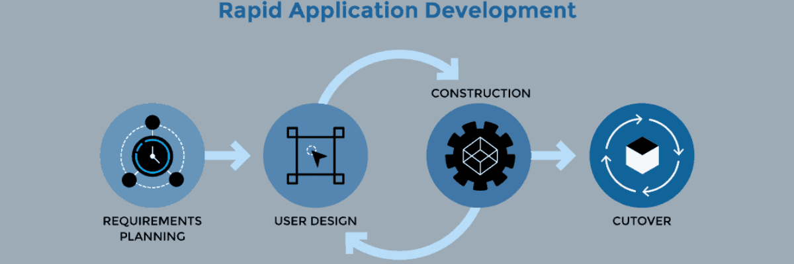

# React UI-Komponentenbibliotheken
> *Basierend auf [React UI-Komponentenbibliotheken: Unsere Top-Picks für 2023](https://kinsta.com/de/blog/react-komponenten-bibliotheken/)*  

React UI-Komponentenbibliotheken sind nützliche Werkzeuge, mit denen du atemberaubende Oberflächen für deine React-basierten Softwareanwendungen und Websites erstellen kannst.

Du kannst zwar für jedes Feature oder jede Funktion, die du in dein Design einbauen willst, deinen eigenen Code schreiben, aber mit einer UI-Komponentenbibliothek wird die ganze Aufgabe einfacher und schneller.

Sie ermöglicht es dir, genau das Teil zu verwenden, das du in deinem Design haben möchtest, z. B. eine Schaltfläche, ohne den Code dafür von Grund auf neu schreiben zu müssen.

Das spart dir nicht nur viel Zeit und Mühe, sondern gibt dir auch die Möglichkeit, über größere Probleme nachzudenken und an Innovationen zu arbeiten.

Jedes Mal, wenn du eine allgemeine Funktion wie eine Tabelle oder eine Karte oder sogar erweiterte Optionen wie Themes hinzufügen möchtest, kannst du einfach aus den verfügbaren Optionen wählen und sie direkt in deinem Design verwenden

Dadurch wird dein Softwareentwicklungsprozess insgesamt schneller und du kannst in kürzerer Zeit mehr hochwertige Anwendungen erstellen.

Wenn du also React-basierte Software entwickelst, ist die Verwendung einer React UI-Komponentenbibliothek von großem Nutzen für dich.

In diesem Artikel stellen wir dir die 21 besten React UI Komponentenbibliotheken vor, die du in deinem nächsten Projekt verwenden kannst. Bevor wir loslegen, wollen wir ein paar grundlegende Konzepte durchgehen, damit du die React UI-Komponentenbibliotheken besser verstehen kannst.

## Was sind React UI-Komponentenbibliotheken?
Eine React UI-Komponentenbibliothek ist ein Werkzeug oder ein Softwaresystem, das gebrauchsfertige Komponenten für React-basierte Anwendungen und Websites enthält. Diese Komponentenbibliotheken helfen dabei, die Softwareentwicklung zu beschleunigen und bieten Entwicklern und Unternehmen viele Vorteile.

Die Komponenten in einer Komponentenbibliothek können Tabellen, Diagramme, Schaltflächen, Karten, Farben und so weiter sein. Außerdem kannst du sie mit vielen Tools anpassen und in deinen Anwendungen nach ihrem Design oder Stil verwenden.

Die Nutzung dieser React UI-Komponentenbibliotheken nimmt zu, da es immer mehr React-basierte Softwaresysteme im Web gibt. React ist eine JavaScript-Bibliothek, mit der du mühelos Benutzeroberflächen für mobile und Web-Anwendungen entwickeln kannst.

Laut Statista ist React im Jahr 2022 das am zweithäufigsten genutzte Web-Framework der Welt. Mit diesem Front-End-JS-Framework lassen sich Anwendungen schneller und einfacher erstellen. Du kannst damit dynamische Webanwendungen erstellen, da sich die Daten auf der Benutzeroberfläche ständig aktualisieren.

Aufgrund seiner Vorteile und Funktionen wird React von Unternehmen und Entwicklern auf der ganzen Welt eingesetzt. Um die App-Entwicklung zu vereinfachen, werden UI-Komponentenbibliotheken erstellt. Wenn du also eine Komponente wie z. B. ein Raster hinzufügen möchtest, musst du den Code dafür nicht selbst schreiben. Stattdessen kannst du eine Komponentenbibliothek verwenden, das gewünschte Raster finden, es nach deinen Bedürfnissen anpassen und direkt hinzufügen.

Und schon bist du fertig!

Schauen wir uns nun einige der wichtigsten Vorteile an, die die Verwendung einer React UI Komponentenbibliothek mit sich bringt.

## Vorteile der Verwendung einer React UI-Komponentenbibliothek

Die Vorteile der Verwendung einer React UI-Komponentenbibliothek sind:

- **Schnellere Entwicklung:** Anstatt den Code für jede Komponente zu erstellen, kannst du eine React UI-Komponentenbibliothek wie MUI, Chakra UI, React Bootstrap usw. verwenden. Sie stellen dir mehrere gebrauchsfertige Komponenten zur Verfügung, die für dein Design geeignet sind. Auf diese Weise sparst du Zeit und kannst schneller Software entwickeln.

- **Schöne UI:** Schneller zu entwickeln bedeutet nicht, dass du beim Aussehen deiner Website oder Anwendung Kompromisse eingehen musst. Ein schönes und zweckmäßiges Design zieht Kunden an. Deshalb kannst du die ästhetisch ansprechenden UI-Komponenten deiner Wahl in deinem Design verwenden und sie an das Aussehen deiner App anpassen.
- **Weniger programmieren, mehr Zeit für die Entwicklung:** Wenn du vorgefertigte Komponenten verwendest, kannst du schneller programmieren. Anstatt Zeit für die Codierung allgemeiner Elemente aufzuwenden, kannst du dich auf die wichtigere Aufgabe konzentrieren – die Anwendung funktional zu machen. Je mehr Zeit du in die Entwicklung investierst, desto besser ist die App.Entwicklung bedeutet, über das Problem oder die Logik deiner Website nachzudenken, sie tatsächlich zu entwickeln, zu debuggen und immer wieder neue Funktionen zu erstellen. Der Einsatz von Bibliotheken kann deinen gesamten Entwicklungsprozess vereinfachen und dir mehr Entlastung verschaffen.Wenn du auf der Suche nach einer zuverlässigen, leistungsstarken und immer verfügbaren Hosting-Plattform bist, ist das Managed WordPress Hosting von Kinsta eine großartige Option. Es bietet schnellere Server, erstklassige Hardware, globale CDNs und einen kompetenten Support.
- **Einfach zu benutzen:** Wenn du ein Anfänger bist oder die Sprache nicht gut beherrschst, kann die Verwendung von CSS manchmal schwierig und langweilig sein, vor allem wenn du komplexe Designs und Layouts erstellst.Wenn du aber eine Komponentenbibliothek verwendest, wird es auch für Anfänger einfacher, schöne und komplexe Layouts und Designs zu erstellen. Allerdings brauchst du immer noch Grundkenntnisse in CSS. Dadurch entfällt auch die mühsame CSS-Wartung. Wenn du mit einer langsamen Website zu kämpfen hast, kannst du das Kinsta APM-Tool verwenden. Es bietet eine Leistungsüberwachung für WordPress-Websites, die auf Kinsta gehostet werden, und ermöglicht es dir, Leistungsprobleme schneller zu erkennen und zu beheben.
